# ElevAI

> **Elevating predictive maintenance by combining collective domain expert knowledge and artificial intelligence.**

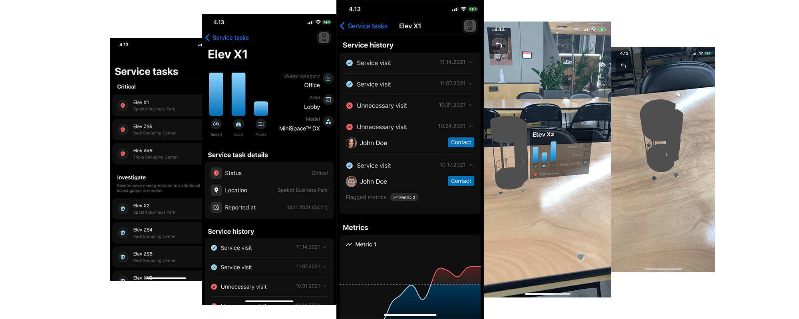

[[ Link to video on Vimeo ]](https://vimeo.com/648187179)
[[ Link to full technical analysis ]](https://github.com/nardeas/elevai/tree/master/notebooks)

## Introduction

KONE moves over 1 billion people per day. Any additional friction in a people flow of this volume will quickly become extremely costly. Predicting the need for preventive maintenance and avoiding unexpected equipment failure is key to KONE's high quality brand.

But it's not just about the brand. An elevator unable to move due to failure can render regular people unable to access their homes. Unnecessary service visits to equipment that don't actually need maintenance eats up resources and potentially postpones other more critical service visits.

**1. The challenge was to create a model that reduces the number unnecessary service visits as predicted by a (larger) base system that automatically produces service tasks (action recommendations) for maintenance personnel** 

**2. The model should be a) accurate and b) explainable. Additionally, rethinking the whole process of preventive maintenance and coming up with out-of-the-box ideas was greatly appreciated.**

**3. Our solution combines the model predicting service task relevance with an improved feedback flow to the base system by leveraging the collective domain knowledge of service personnel.** 

## Data

> For additional details and technical implementation see the `notebooks/` section in this repository for the actual data and model analysis

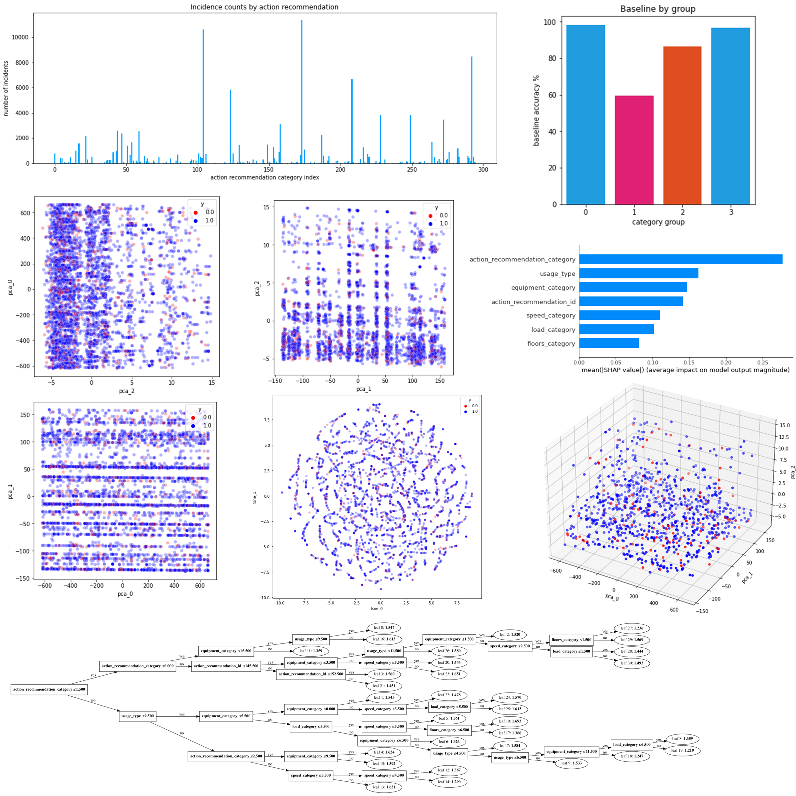

To create a system that can learn real-world data is needed. But having just data is not enough. Quality data is needed for good model performance. In academia datasets might be perfect, but in real life that's often not the case. To understand the problem space we conduct a thorough investigation of the dataprovided by our challenge partner.

#### Class imbalance

The first thing that popped up in our data investigation was the heavy class imbalance in the target labels. Most of the events (87% of the data) were events where maintenance need was real (class 1) and only 13% of the events were unnecessary visits (class 0). Due to this imbalance a naive model is able to perform well by just predicting all events as *necessary maintenance visits* (class 1).

#### Subcategory imbalance

Clustering the data revealed that some categories produce most of the events. What this means is that some equipment with certain combination of sensors is over-represented in the data compared to other subcategories. To make it even harder, some of these categories seem to produce a lot of incorrect maintence signals.

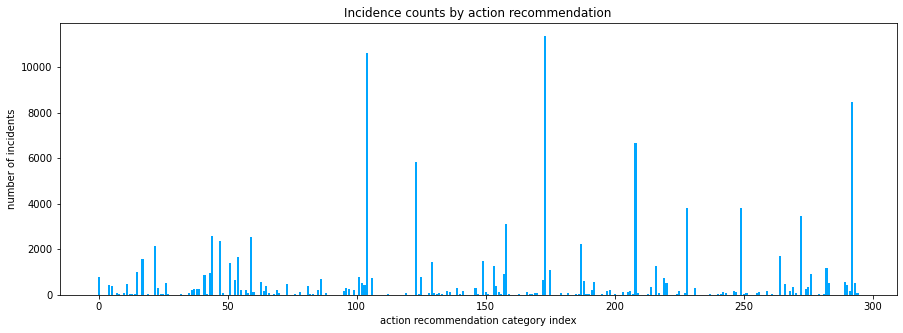

If the underlying features are noise for some subcategories the model can't learn. If these events overpopulate the data, the model results are hard to interpret since good performance in some areas of the data can be hard to notice. Cost of an event is high which means that better performance in some areas of the data is valuable.

A preliminary investigation revealed that we are able to show improved performance over benchmark in some subcategories. For example:
```
Subcategory:
- action_recommendation_category:  arc02
- equipment_category: tp007
- usage_type: ut011
- event count: 2679

Naive baseline:
- f2 score: 0.92299
- accuracy: 0.70586

Our model:
- f2 score: 0.926601
- accuracy: 0.737212
```

This means that when the data is good we can learn. We just have to ensure better data is available. 

### Grouping

We explore further combinations of `action_recommendation_id, action_recommendation_category, equipment_category` and `usage_type`. By grouping the data by unique combinations of these columns we can explore where most of the errors are made by computing the accuracy for each combination and segmenting the data into groups with lower than threshold accuracy (group 1), higher than threshold accuracy (groups 0, 3) and between thresholds accuracy (group 2).

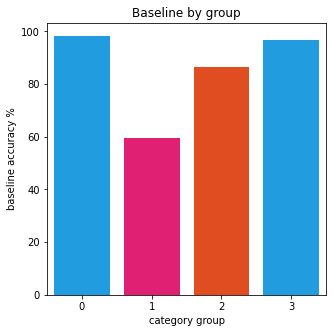

Above graph highlights the obvious fact that most of the errors are made in groups 1 and 2. Remarkably, almost no errors are made in groups 0 and 3 (ratio of true positives is very close to 100%). This means that most of the improvement a model can potentially bring to the table happens in lower than threshold and between thresholds groups denoted by a set unique combinations of the selected grouping columns.

### Dimensionality

We performed dimensionality analysis using various techniques to explore any obvious clustering that could reveal clear improvement potential. Principal component analysis did not reveal any meaningful clustering with respect to correct/incorrect labels:

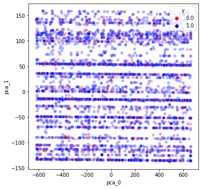
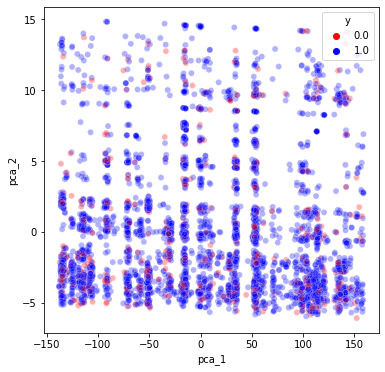
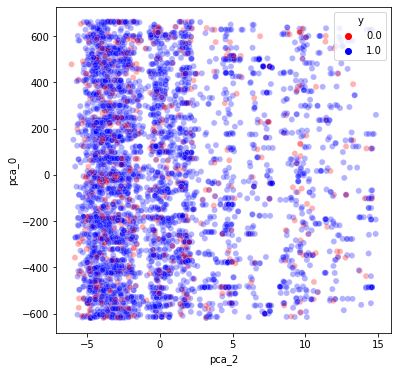

Additionally, t-distributed Stochastic Neighbour Embedding (t-SNE) was utilized to obtain learned dimensionality reduction for visualization and clustering. It also did not reveal any obvious patterns, which leads us to conclude that for this dataset and modelling task only marginal improvements should be expected. 

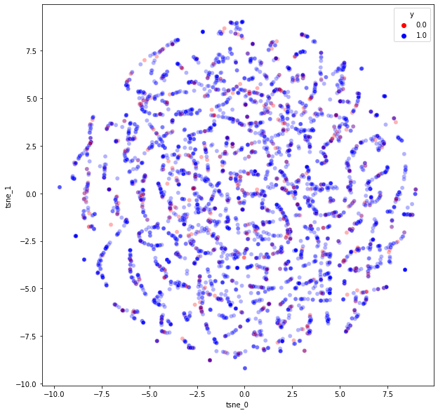

## Model

GBT (Gradient Boosting Tree) based models perform exceptionally well with structured data. This approach was chosen here after evaluating various other baseline methods like linear/logistic regression, support-vector machines and vanilla ensemble methods like random forest. Non-parametric methods or other non-gradient methods were not explored due to time limitations.

Various gradient boosting frameworks exist but the best performance, flexibility and robustness was found with Xtreme gradient boosting (XGBoost). The key is to improve the F2 score of the prediction so this was a natural target metric choice in hyperparameter tuning.

### Explainability

Tree based models are in theory fully human interpretable if we visualize the decision trees in terms of feature selection rules. Example tree below:

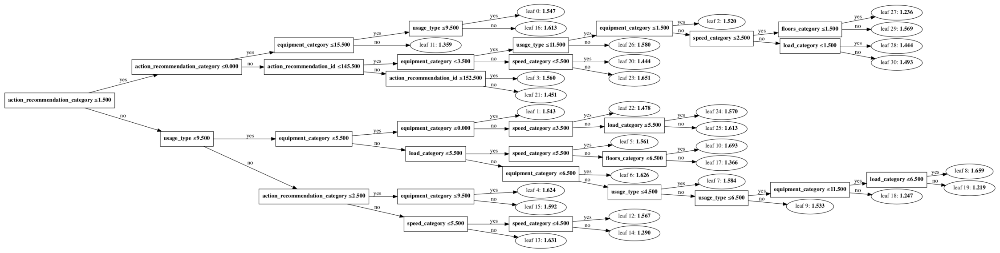

By inspecting each tree in the model ensemble one can in theory fully trace the decision making path from input features to outputs.

Another method for explaining the model outputs that works even for fully black-box models is the Shapley method. It explores the per feature contribution to output magnitude and can reveal relative feature importances:


Above graph also shows the selected features used in the test data submission.

### Conclusions

The knowledge collected in the data analysis phase revealed that improving the model significantly would be impossible. The actual problem is that the underying features are not descriptive enough and can only lead to marginal improvements. This lead us to step outside the box and rethink the whole process.

## How it's used in real life

In our solution we ended up solving the problem in two ways:

1. We use machine learning within the limitations of the current dataset. This means that we have to be able to identify the reliable predictions from the unreliable. We did this by tagging all events our system predicted unreliable for the technician. Technician is then able to make the final decision based on the model prediction and historical maintenance data shown in the app.

2. Unnecessary maintance visit can still be valuable if we can collect information from it. Our UI feature preview allows the technician to specify the reasons why a visit was (or wasn't) necessary. This will increase the visibility of the raw signals that the sensors and base system produce. This also means that, for example, in a case where certain spare parts have quality errors it should be visible in our data very quickly since technicians around the world can flag e.g high wear sensory readouts in a specific part as the reason for the maintenance need.

Check out how our app allows the technician to make the correct decision on maintenance task.

| 1 | 2 | 3 | 4 | 
|--------|------|------------|----------|
|        |      |            |          |
| 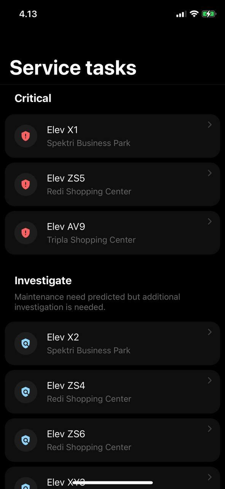 |      |            |          |

1. First view lists the service tasks categorized by the reliability: events with uncertantly require additional investigation from the technician before the visit


2. To help the technician make the right decision the event view shows maintenance history and the people who where involved in previous maintenance visits. For further analysis the technician is able to see the underlying real-time sensory data that can reveal important trends. This data is sorted based on the relevance from the previous insidents that had overlapping features.

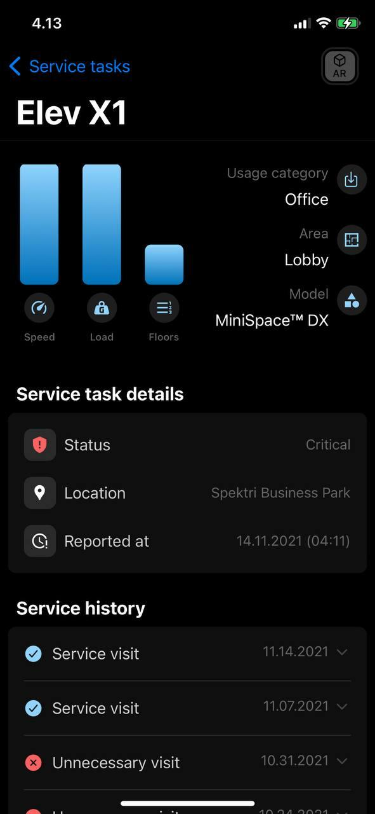

3. After maintenance visit the technician marks the data sources that were important to find out the underlying problem. These findings are shared between all technicians globally which ensures better knowledge sharing. This data is also important for the personnel which design algorithms that use the data.

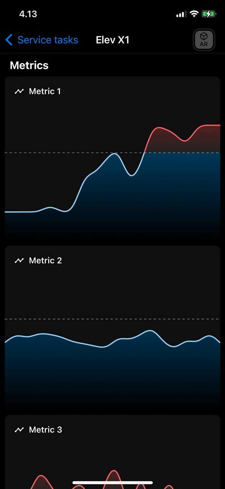

4. As a final thing we want to ensure ability to inspect the equipment remote as much as possible. AR allows the technician to visualize the object for remote inspection.

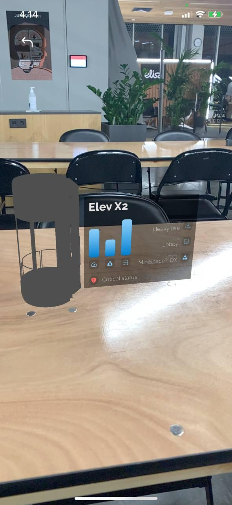
